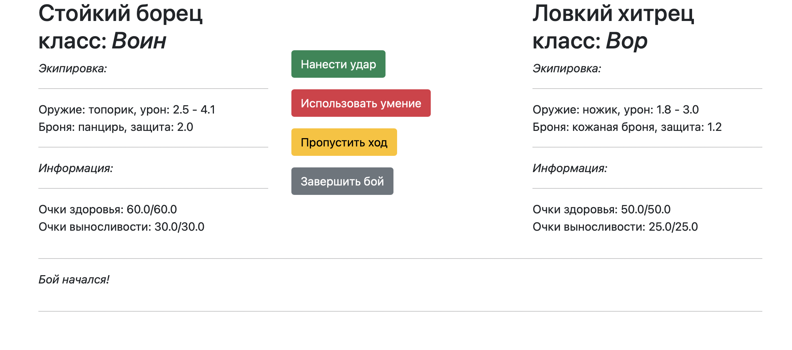

# SkyWars Fighting Game

## Description

A simple fighting game between a user and the computer.


## Technologies
* Flask==2.0.2
* gunicorn==20.1.0
* marshmallow==3.14.1
* marshmallow-dataclass==8.5.3
* Jinja2==3.0.3

## Installation
- Clone the repository
  ```
  git clone https://github.com/TatianaBelova333/fighting_game.git
  ```
- Install all dependencies and activate virtual enironment
  ```
  python -m venv venv
  ```
  ```
  pip install -r requirements.txt
  ```
- Run the project
  
  ```
  python3 run.py
  ```
### Authors
[Tatiana Belova](https://github.com/TatianaBelova333)
